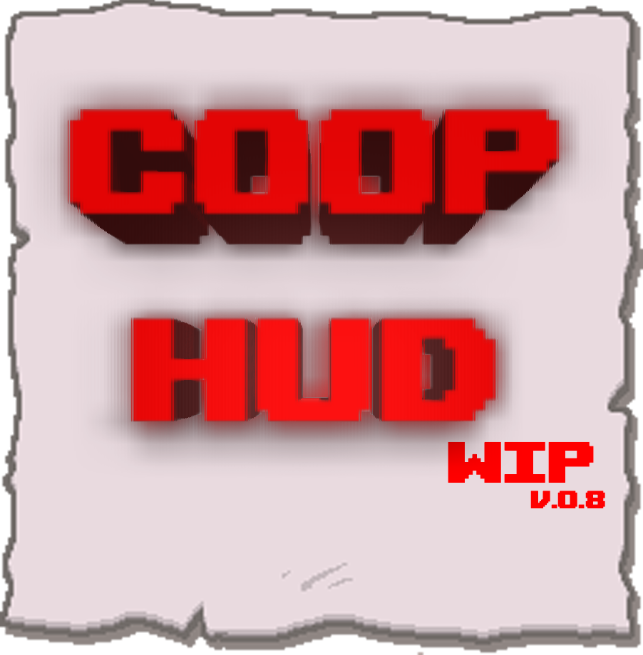

  

# Coop HUD - proper HUD for coop Isaac

This mod renders active items/pocket/trinkets in proper position for coop game up to 4 players.

### MOD IS STILL DEVELOPED PLEASE SUBMIT ANY WEIR BEHAVIOUR ( weird positions/ console errors/ log files) in Bugs topic

## Features

* Renders actives/hearts/trinkets/pockets in proper and readable position for up to 4 players (8 characters max)
* Colorfully player sprites/text infos
* Show pockets/pills/card names
* Shows health bar with Mantle Indicator for all players
* Vanilla like prompts (using cards/ pills/ active items/ transformations ) with color of player
* Stats - just like vanilla FoundHUD stat display:
  * Show stats up to 4 players on screen
  * Highlight on map button
  * Stat colors
* Hide stats on battle function
* Angel/Devil/Planetarium chances - with customizable positions
* ExtraHUD - just like vanilla collectibles list:
  * In 1 player mode shows just like in classic Isaac
  * In coop shown instead of stats, just hold MAP button
  * Shows up to 52 recent passive items/gulped trinkets
  * For Essau collectibles - press DROP button
* Jacob and Essau - up to 4 pairs of Jacob and Essau with readable:
  * Shows Essau collectibles (press DROP button)
  * Shows Essau stats (when more than 2 players or forced small hud press DROP button)
* Tainted Support
  * Tainted Isaac: shows inventory for all 4 players
  * Tainted Maggy: pulsing hearts
  * Tainted ???: show Poop Spells and Hold Spell for all 4 players
  * Tainted Cain: shows Bag of Crafting recipe and crafting for all 4 players
* HUD toggle button - adjust in options
* Bag of Crafting - active item crafting result preview

## Requirements/ needed mods

coopHUD lack of couple things like boss bars or minimap. For best experience use below mods.

* mod options: [Mod Config Menu - Continued](https://steamcommunity.com/workshop/filedetails/?id=2487535818) or [Mod Config Menu - Pure](https://steamcommunity.com/sharedfiles/filedetails/?id=2681875787)
  My mod should override MiniMAPI settings:
  * General -> Display on No HUD seed - On
  * Map (1) - > Show map effect icons - Off
* minimap: [MiniMAPI: A Minimap API](https://steamcommunity.com/sharedfiles/filedetails/?id=1978904635) from [Wofsauge](https://steamcommunity.com/id/Wofsauge)
* boss bars: [Enhanced Boss Bars](https://steamcommunity.com/sharedfiles/filedetails/?id=2635267643) from [Wofsauge](https://steamcommunity.com/id/Wofsauge)

## Planned features/not working:

* RunInfo: No Achievement/Hard Mode/Victory Laps
* Waves info: Greed Waves,Gideon Waves
* Modded cards/pills
* Modded characters head indicator
* Fiend Folio 

## Known bugs:
* Custom challenge destination indicator
* Bag of crafting - when collecting couple items at once, they might get added in invalid order. Might mess crafting result
* Fortune Teller notes/ Rules streak info are not showing - no api function to catch that
* Gideon Waves: cannot get current gideon wave
* Jacob & Essau: player info covers stats when too many things
* On full discovered large map covers - stats/timer
* Urn of soul - cannot get souls from game API, only opened/closed sprite indicator - [PERM]
* For 2nd player when map button pressed theres weird position loop (miniApi bug)
* T.???:Poop spells not visible when have second pocket

## Mods compatibility:

* It's compatible with most of modded trinkets and items
* Support modded sprites
* [External item descriptions](https://steamcommunity.com/sharedfiles/filedetails/?id=836319872) from [Wofsauge](https://steamcommunity.com/id/Wofsauge)
* [Encyclopedia - An In-Game Wiki](https://steamcommunity.com/sharedfiles/filedetails/?id=2376005362) from [AgentCucco](https://steamcommunity.com/id/AgentCucco)
* Compatible and improving gameplay mods are in my [collection](https://steamcommunity.com/workshop/filedetails/?id=2738883704)

## Thanks to!

* [Wofsauge](https://steamcommunity.com/id/Wofsauge) for TBoI API and his mods which helped in developing this one

### Whats new

### v.8.7:

* Code reorganizing
* Fixed transformation strings now in proper language 
* Bag of Crafting - better crafting logic (it tends to craft in mod but not in game)
* Tainted Samson - player color intensity will increase when Samson gains Berserk, no color for unloaded berserk
* Added check for pickup items (from pedestals or crafting) - wont add item when messed up crafting result
* HUD scaling - you can set custom HUD scale in settings

# Screens

  
  
  
  
  
  

## Installation

Simply subscribe mod od [Steam Workshop Page](https://steamcommunity.com/sharedfiles/filedetails/?id=2731267631)
or Clone main branch of this repository and paste into Isaac mod folder

